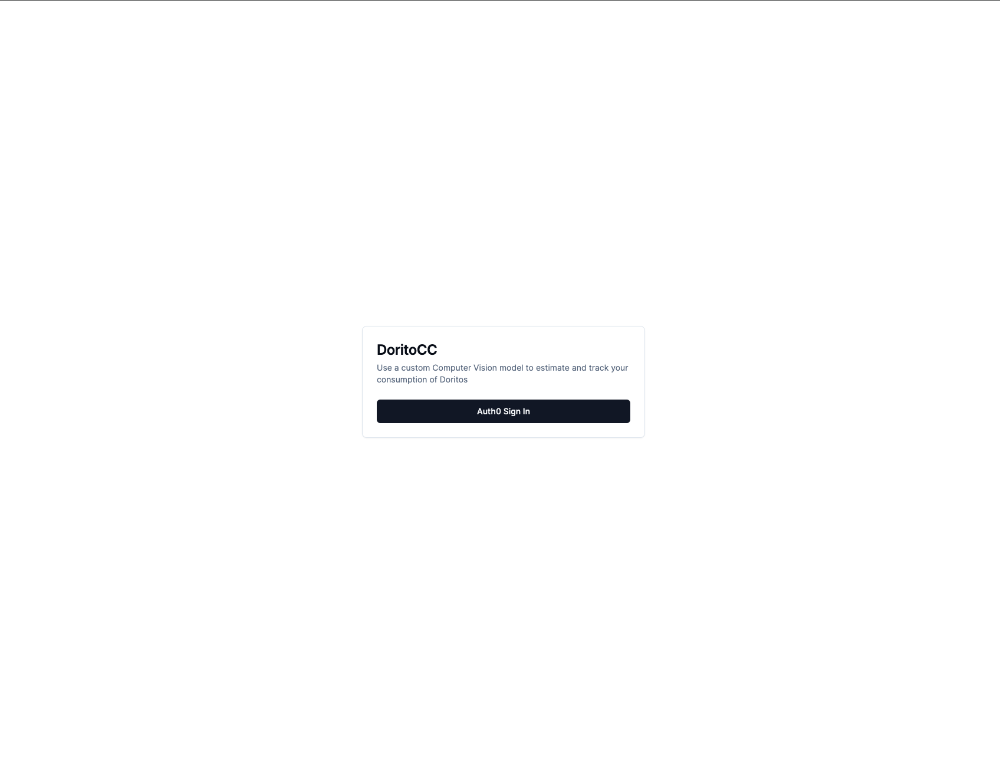
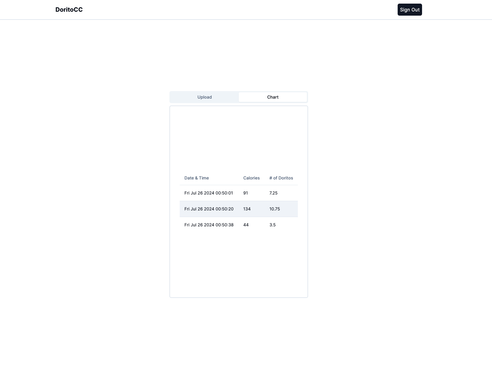

This is a [Next.js](https://nextjs.org/) project bootstrapped with [`create-next-app`](https://github.com/vercel/next.js/tree/canary/packages/create-next-app).

## Getting Started

First, run the development server:

```bash
npm run dev
# or
yarn dev
# or
pnpm dev
# or
bun dev
```

Open [http://localhost:3000](http://localhost:3000) with your browser to see the result.

This project utilizes [Auth0](https://auth0.com/), [Roboflow](https://roboflow.com/), and [Firestore](https://firebase.google.com/docs/firestore), and are requirements for getting up and running locally. That being said, there are environment variables associated with each service that will need to be set up locally in order to use the application.

## Screenshots

### Auth



### Calorie Counter



